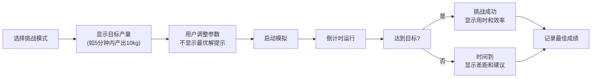

## 1. 产品概述

传统踏碓舂米效率物理模拟器，通过Matter.js物理引擎还原古代踏碓工作原理，用户可调整结构参数和运行条件，观察不同配置下的舂米效率。适用于物理教学、历史科技展示以及工程力学爱好者。

- 核心目标：通过可视化物理模拟，让用户直观理解杠杆原理、动量传递和效率优化
- 目标用户：学生、教师、物理爱好者、历史文化研究者
- 产品价值：将抽象的物理公式转化为可交互的可视化体验，寓教于乐

## 2. 核心功能

### 2.1 用户角色
| 角色 | 注册方式 | 核心权限 |
|------|----------|----------|
| 普通用户 | 无需注册 | 自由实验、挑战模式、查看历史记录 |

### 2.2 功能模块
1. **主模拟页面**：侧视物理场景、参数控制面板、实时数据显示
2. **模式选择**：自由实验模式、目标产量挑战模式
3. **统计分析**：舂击次数统计、有效冲击率曲线、产量估算图表
4. **实验记录**：历史实验参数和效率曲线存储与回顾

### 2.3 页面详情
| 页面名称 | 模块名称 | 功能描述 |
|---------|---------|----------|
| 主模拟页面 | 物理场景渲染 | 2D侧视踏碓物理模型实时渲染，碓头起落动画 |
| 主模拟页面 | 参数控制面板 | 踏板长度、支点位置、踩踏频率、谷物重量滑块调节 |
| 主模拟页面 | 模式切换 | 自由实验/目标挑战模式切换，挑战目标显示 |
| 主模拟页面 | 实时数据面板 | 当前舂击次数、有效冲击率、累计产量、当前效率 |
| 主模拟页面 | 统计图表区 | Recharts绘制效率曲线、冲击次数柱状图、产量趋势图 |
| 主模拟页面 | 实验记录列表 | 历史实验参数和结果展示，可点击回放 |
| 主模拟页面 | 启动/暂停/重置 | 模拟控制按钮组 |

## 3. 核心流程

### 3.1 自由实验模式流程

### 3.2 挑战模式流程

## 4. 用户界面设计

### 4.1 设计风格
- **主色调**：暖木色 (#8B4513) 为主，土黄色 (#D2B48C) 为辅，体现传统农具的自然质感
- **点缀色**：青竹绿 (#2E8B57) 用于有效状态，锈红色 (#CD5C5C) 用于警告/不足状态
- **背景**：米白色宣纸质感纹理，营造古朴典雅氛围
- **按钮风格**：圆角实木质感按钮，hover时有轻微上浮阴影
- **字体**：标题使用「ZCOOL XiaoWei」彰显中国风，正文使用「Noto Serif SC」保证可读性
- **布局**：三栏布局 - 左侧参数控制、中间物理场景、右侧统计图表
- **图标**：使用Lucide图标，配合emoji增强传统氛围（🌾 🏺 ⚙️ 📊）

### 4.2 页面设计概述
| 页面名称 | 模块名称 | UI元素 |
|---------|---------|--------|
| 主模拟页面 | 顶部标题栏 | 项目名称、模式切换、实验记录按钮 |
| 主模拟页面 | 左侧控制面板 | 参数滑块组、参数数值显示、参数有效性提示 |
| 主模拟页面 | 中央模拟区 | Canvas物理场景、踏碓侧视图、碓头高度标线 |
| 主模拟页面 | 底部控制栏 | 启动/暂停/重置按钮、运行时长显示 |
| 主模拟页面 | 右侧统计区 | 实时数据卡片、效率曲线图、冲击次数柱状图、产量趋势图 |
| 主模拟页面 | 挑战模式弹窗 | 目标说明、倒计时、成绩排行榜 |

### 4.3 响应性
- **桌面优先**：三栏布局（控制25% + 模拟50% + 统计25%）
- **平板适配**：上下布局（控制+模拟在上，统计在下）
- **移动适配**：Tab切换三个区域，触控滑块优化
- **触控优化**：滑块增大触控区域，按钮最小44x44px

### 4.4 物理场景视觉指导
- **视角**：2D侧视图，地平线在下方1/4处
- **场景元素**：木质踏板、石质碓头、竹制支架、陶制谷臼
- **动画细节**：踏板踩踏时有轻微形变，碓头冲击时有碎屑飞散，谷物堆积有颗粒感
- **光照**：左上45度暖光，物体有柔和阴影
- **性能**：Matter.js渲染控制在60fps，粒子效果限制数量
