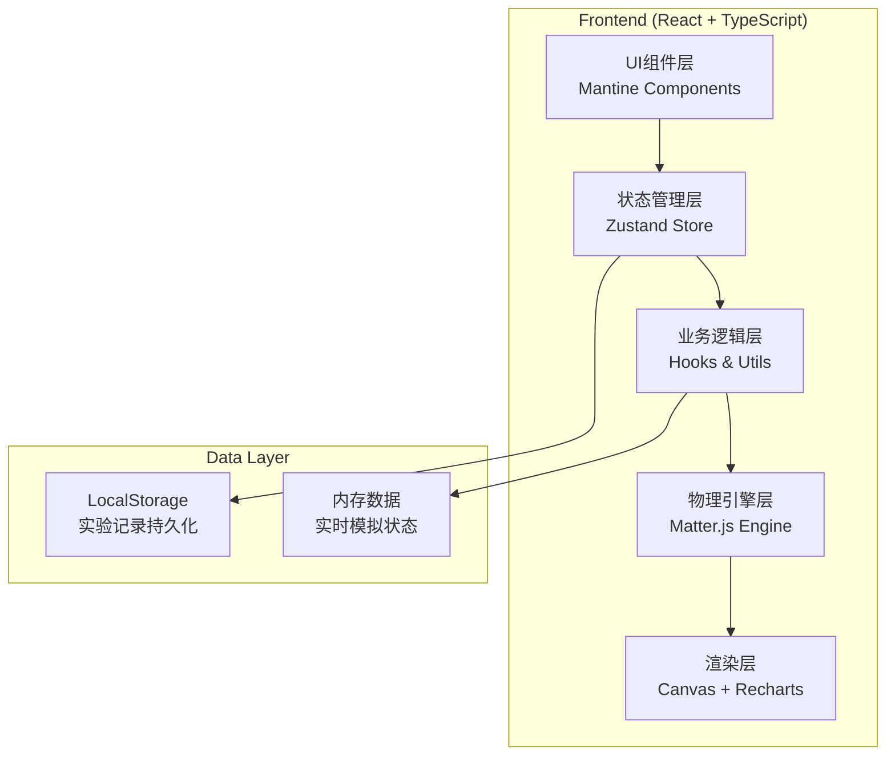

## 1. 架构设计



## 2. 技术描述

- **前端框架**: React@18 + TypeScript@5 + Vite@5
- **UI组件库**: Mantine@7 (@mantine/core, @mantine/hooks, @mantine/form)
- **物理引擎**: matter-js@0.19 + @types/matter-js
- **图表库**: recharts@2
- **状态管理**: zustand@4
- **图标**: lucide-react@0.344
- **样式方案**: Mantine CSS-in-JS + 自定义主题
- **数据持久化**: localStorage (实验记录)

## 3. 项目结构

```
src/
├── components/          # React组件
│   ├── ControlPanel/    # 参数控制面板
│   ├── Simulation/      # 物理模拟场景
│   ├── StatsPanel/      # 统计图表面板
│   ├── ModeSelector/    # 模式选择器
│   ├── RecordList/      # 实验记录列表
│   └── common/          # 公共组件
├── hooks/               # 自定义Hooks
│   ├── useMatterEngine.ts    # Matter.js引擎Hook
│   ├── useSimulation.ts      # 模拟逻辑Hook
│   └── useEfficiencyCalc.ts  # 效率计算Hook
├── store/               # Zustand状态管理
│   └── simulationStore.ts
├── types/               # TypeScript类型定义
│   └── index.ts
├── utils/               # 工具函数
│   ├── physics.ts       # 物理计算工具
│   ├── validation.ts    # 参数验证
│   └── storage.ts       # 本地存储
├── pages/               # 页面组件
│   └── SimulationPage.tsx
├── App.tsx
├── main.tsx
└── theme.ts             # Mantine主题配置
```

## 4. 类型定义

```typescript
// 模拟参数
interface SimulationParams {
  pedalLength: number;      // 踏板长度 (m)
  pivotPosition: number;    // 支点位置 (距离踏板左端, m)
  stepFrequency: number;    // 踩踏频率 (Hz, 次/秒)
  grainWeight: number;      // 谷物重量 (kg)
}

// 模拟状态
interface SimulationState {
  isRunning: boolean;
  isPaused: boolean;
  elapsedTime: number;      // 运行时长 (s)
  totalStrikes: number;     // 总舂击次数
  effectiveStrikes: number; // 有效舂击次数
  currentHeight: number;    // 碓头当前高度
  maxHeight: number;        // 碓头最大高度
  accumulatedYield: number; // 累计产量 (kg)
  efficiencyHistory: EfficiencyPoint[];
}

// 效率数据点
interface EfficiencyPoint {
  time: number;
  effectiveRate: number;    // 有效冲击率 (%)
  yieldPerHour: number;     // 时产量 (kg/h)
  totalStrikes: number;
}

// 实验记录
interface ExperimentRecord {
  id: string;
  timestamp: number;
  params: SimulationParams;
  mode: 'free' | 'challenge';
  duration: number;
  totalStrikes: number;
  effectiveStrikes: number;
  finalYield: number;
  avgEfficiency: number;
  challengeTarget?: number;
  challengeSuccess?: boolean;
}

// 模式
type SimulationMode = 'free' | 'challenge';

// 挑战配置
interface ChallengeConfig {
  targetYield: number;      // 目标产量 (kg)
  timeLimit: number;        // 时间限制 (s)
  hint: string;
}
```

## 5. 核心算法

### 5.1 有效舂击判定
```typescript
// 有效冲击高度阈值 (m)
const MIN_EFFECTIVE_HEIGHT = 0.15;

function isEffectiveStrike(impactVelocity: number, dropHeight: number): boolean {
  // 下落高度必须大于阈值
  if (dropHeight < MIN_EFFECTIVE_HEIGHT) return false;
  
  // 冲击动量必须足够 (动量 = 质量 * 速度)
  const momentum = PESTLE_WEIGHT * impactVelocity;
  return momentum > MIN_EFFECTIVE_MOMENTUM;
}
```

### 5.2 谷壳脱落效率计算
```typescript
function calculateHuskRemovalRate(
  impactEnergy: number,
  grainWeight: number,
  strikeCount: number
): number {
  // 基础脱壳率与冲击能量成正比
  const baseRate = Math.min(0.8, impactEnergy / (grainWeight * 10));
  
  // 累计效应：多次舂击提高脱壳率
  const cumulativeFactor = 1 - Math.exp(-strikeCount / 5);
  
  // 最终脱壳率 (0-1)
  return baseRate * cumulativeFactor * 0.95;
}
```

### 5.3 产量估算
```typescript
function estimateYield(
  effectiveStrikes: number,
  grainWeight: number,
  avgHuskRemovalRate: number
): number {
  // 假设每次有效舂击处理部分谷物
  const processedPerStrike = grainWeight * 0.1;
  
  // 净产量 = 处理量 * 脱壳率 * 出米率(约70%)
  return effectiveStrikes * processedPerStrike * avgHuskRemovalRate * 0.7;
}
```

## 6. 物理模型设计

### 6.1 Matter.js物体组成
- **踏板 (Pedal)**: 长条形刚体，可绕支点旋转
- **支点 (Pivot)**: 固定约束点
- **碓头 (Pestle)**: 垂直悬挂的重锤，通过连杆与踏板连接
- **连杆 (Connecting Rod)**: 连接踏板右端和碓头上端
- **谷臼 (Mortar)**: 底部固定容器，装有谷物
- **谷物 (Grains)**: 复合粒子系统，模拟谷物堆积

### 6.2 物理约束
- 踏板与支点：旋转约束 (Revolute Constraint)
- 踏板与连杆：旋转约束
- 连杆与碓头：旋转约束
- 碓头垂直方向：平移约束 (只允许上下运动)

### 6.3 踩踏力模拟
```typescript
// 根据踩踏频率生成周期性作用力
function generateStepForce(time: number, frequency: number): number {
  const period = 1 / frequency;
  const phase = (time % period) / period;
  
  // 踩踏力曲线：快速下踩，缓慢抬起
  if (phase < 0.3) {
    // 下踩阶段：正弦曲线上升
    return Math.sin(phase / 0.3 * Math.PI / 2) * MAX_STEP_FORCE;
  } else if (phase < 0.4) {
    // 保持最大力
    return MAX_STEP_FORCE;
  } else {
    // 抬起阶段：逐渐减小
    return Math.sin((1 - (phase - 0.4) / 0.6) * Math.PI / 2) * MAX_STEP_FORCE * 0.3;
  }
}
```

## 7. 状态管理设计 (Zustand)

```typescript
interface SimulationStore {
  // 参数
  params: SimulationParams;
  setParams: (params: Partial<SimulationParams>) => void;
  
  // 状态
  state: SimulationState;
  isRunning: boolean;
  isPaused: boolean;
  
  // 模式
  mode: SimulationMode;
  challengeConfig: ChallengeConfig | null;
  setMode: (mode: SimulationMode) => void;
  
  // 控制
  start: () => void;
  pause: () => void;
  resume: () => void;
  reset: () => void;
  
  // 记录
  records: ExperimentRecord[];
  saveRecord: () => void;
  loadRecord: (id: string) => void;
  deleteRecord: (id: string) => void;
}
```

## 8. 参数验证规则

```typescript
function validateParams(params: SimulationParams): ValidationResult {
  const errors: Record<string, string> = {};
  
  // 踏板长度必须 > 0
  if (params.pedalLength <= 0) {
    errors.pedalLength = '踏板长度必须大于0';
  }
  
  // 踩踏频率必须 > 0
  if (params.stepFrequency <= 0) {
    errors.stepFrequency = '踩踏频率必须大于0';
  }
  
  // 谷物重量必须 > 0
  if (params.grainWeight <= 0) {
    errors.grainWeight = '谷物重量必须大于0';
  }
  
  // 支点必须在踏板范围内
  if (params.pivotPosition <= 0 || params.pivotPosition >= params.pedalLength) {
    errors.pivotPosition = `支点位置必须在0到${params.pedalLength.toFixed(2)}m之间`;
  }
  
  return {
    valid: Object.keys(errors).length === 0,
    errors
  };
}
```
